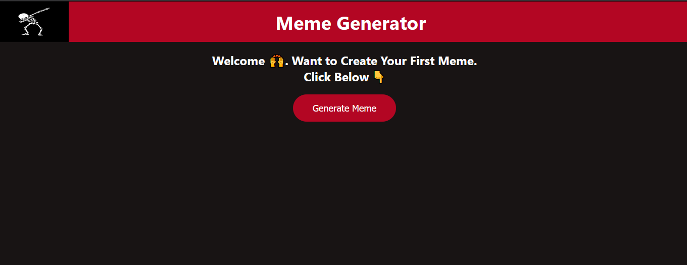
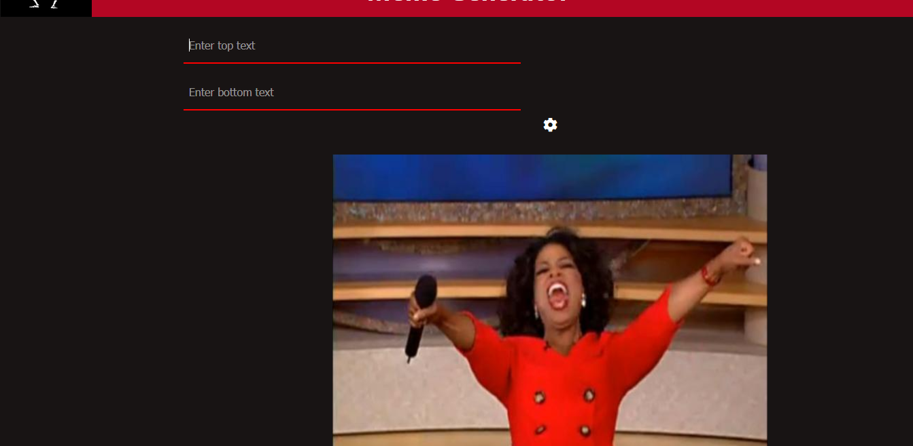
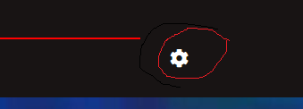
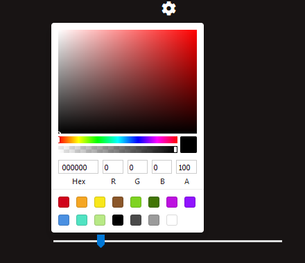
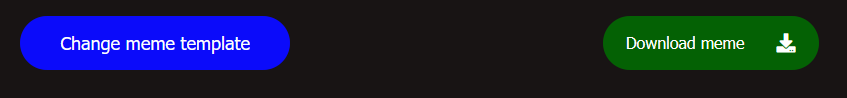

Meme Generator:
	It's a simple meme generator built by using react where you make memes with built-in templates. Here's a   snapshot of the starting page  
	
	

	<b>How to use</b><>:
			From previous snapshot it's quiet clear we simply press the button to make meme. When you press   the button this snapshot appears:  

			

			There's two input felids which demands you to add top and bottom text for the below template.  What if You don't like this template and want to change it you simply scroll towards bottom and   change template through <b>Change Meme template Button</b>    

			

			You can click it until you didn't find your desire template.  
			If you want to change text size or text color you simply click this button
			 
			  Then a dialogue box appears like this 
			 
			   You can set the color of the text by this color picker and size of the text by slider according   to you requirement

			 All set Your meme is ready but you might worry how to take it or download it. You can simply download it by clicking the Download Meme  button.
			 

			 It's downloaded the meme on your default downloads folder
